# git@github.com:JoonasMagi/devmons.git

## 1. Introduction

### 1.1 Project Purpose and Scope

The purpose of this project is to develop a comprehensive project management information system that enables software development teams to plan, track, and manage their work efficiently. The system will provide core functionality for task management, team collaboration, and project visibility.

**Scope includes:**
- Task and issue tracking with customizable workflows
- Visual kanban board for task management
- Sprint planning and iteration management
- Team collaboration features
- Real-time progress tracking and reporting
- User and permission management

**Out of scope:**
- Time tracking and billing
- Resource management across multiple projects
- Advanced reporting and analytics (Phase 2)
- Integration with external systems (initial release)

### 1.2 Background and Current Situation

Modern software development teams require efficient tools to manage complex projects with multiple stakeholders. Currently, many teams either use spreadsheets, multiple disconnected tools, or expensive enterprise solutions that are overly complex for their needs.

The market leaders (Jira, Trello, Pivotal Tracker) demonstrate that teams need:
- Simple visual task organization (Trello's kanban approach)
- Structured workflow management (Jira's issue types and statuses)
- Agile planning capabilities (Pivotal Tracker's story points and velocity)

Our system aims to combine these essential features into a streamlined, cost-effective solution suitable for small to medium-sized development teams.

### 1.3 Stakeholders and Target Audience

**Primary Stakeholders:**
- Development teams (2-20 members)
- Project managers and scrum masters
- Product owners
- Team leads and technical managers

**Target Audience:**
- Software development companies
- Startups and scale-ups
- IT departments in mid-sized organizations
- Remote and distributed teams

**Key Stakeholder Needs:**
- Developers: simple task assignment, clear priorities, minimal overhead
- Project Managers: overview of project status, sprint planning, blocking issues
- Product Owners: backlog management, feature prioritization
- Management: high-level progress visibility, delivery predictability

---

## 2. Concepts and Terminology

### 2.1 Glossary

**Agile Terms:**
- **Sprint**: A fixed time period (typically 1-4 weeks) during which specific work must be completed
- **Story Point**: A unit of measure for expressing the estimated effort required to implement a user story
- **Velocity**: The amount of work (in story points) a team completes in a sprint
- **Backlog**: A prioritized list of work items to be completed
- **Epic**: A large body of work that can be broken down into smaller stories

**System Terms:**
- **Board**: Visual representation of work items organized in columns
- **Card/Ticket**: A work item that can be moved across the board
- **Workflow**: The sequence of statuses a work item goes through from creation to completion
- **Swimlane**: Horizontal grouping on a board (e.g., by assignee or priority)
- **Label/Tag**: Categorization mechanism for work items

**User Roles:**
- **Admin**: Full system access and configuration rights
- **Project Owner**: Manages project settings, members, and backlog
- **Team Member**: Creates and updates work items, participates in sprints
- **Viewer**: Read-only access to projects

**Abbreviations:**
- **API**: Application Programming Interface
- **UI/UX**: User Interface / User Experience
- **CRUD**: Create, Read, Update, Delete
- **REST**: Representational State Transfer
- **JWT**: JSON Web Token
- **DTO**: Data Transfer Object

---

## 3. Business Needs and Context

### 3.1 Problem Description

Software development teams face several challenges in managing their work:

1. **Lack of visibility**: Teams struggle to understand what work is in progress, what's blocked, and what's coming next
2. **Communication overhead**: Without a centralized system, teams waste time in status meetings and email chains
3. **Poor prioritization**: Work items are not clearly prioritized, leading to context switching and inefficiency
4. **No historical data**: Teams cannot analyze their performance or improve their estimation accuracy
5. **Tool fragmentation**: Using multiple disconnected tools leads to duplication and synchronization issues

These problems result in delayed deliveries, team frustration, and inability to predict project timelines accurately.

### 3.2 Business Processes and Workflows

**Core Workflow 1: Issue Lifecycle**
1. Product owner creates issue in backlog with description and acceptance criteria
2. Team estimates effort during backlog refinement
3. Issue is prioritized and added to sprint during sprint planning
4. Developer moves issue to "In Progress" and begins work
5. Upon completion, issue moves to "Code Review"
6. After approval, issue moves to "Testing"
7. QA validates and moves to "Done" or back to development if issues found
8. Sprint concludes with retrospective and planning for next sprint

**Core Workflow 2: Board Management**
1. Project owner creates board with custom columns matching team workflow
2. Team members create cards representing work items
3. Cards are assigned to team members and tagged with relevant labels
4. Team conducts daily standup reviewing board state
5. Cards move across columns as work progresses
6. Completed cards are archived but remain searchable

**Core Workflow 3: Sprint Planning**
1. Team reviews velocity from previous sprints
2. Product owner presents prioritized backlog items
3. Team discusses and estimates work items using story points
4. Team commits to sprint goal and selected work items
5. Sprint begins with clear capacity and scope
6. Mid-sprint adjustments are made if necessary
7. Sprint ends with demo and retrospective

### 3.3 User and Client Needs

**Development Team Needs:**
- Quick task creation and updates with minimal clicks
- Clear indication of task priority and dependencies
- Ability to filter and search tasks efficiently
- Drag-and-drop interface for status updates
- Comments and attachments on tasks for collaboration

**Project Manager Needs:**
- Real-time overview of sprint progress
- Identification of blockers and risks
- Sprint burndown and velocity charts
- Capacity planning tools
- Historical data for future estimation

**Product Owner Needs:**
- Easy backlog prioritization
- Feature roadmap visualization
- Ability to link related work items
- Release planning capabilities

**Management Needs:**
- High-level project health indicators
- Delivery timeline predictions
- Team productivity metrics
- Cross-project reporting

### 3.4 Competition and Alternative Solutions

**Jira (by Atlassian)**
- Strengths: Highly customizable, enterprise-grade, extensive integration ecosystem
- Weaknesses: Complex interface, steep learning curve, expensive for small teams
- Key Features: Custom workflows, advanced reporting, roadmaps

**Trello (by Atlassian)**
- Strengths: Extremely simple and intuitive, fast to set up, visual kanban boards
- Weaknesses: Limited for complex projects, lacks agile planning features
- Key Features: Card-based system, drag-and-drop, power-ups for extensions

**Pivotal Tracker**
- Strengths: Excellent for agile teams, automatic prioritization, velocity tracking
- Weaknesses: Opinionated workflow, less flexible, focused mainly on stories
- Key Features: Story points, icebox, current/backlog sections, velocity-based planning

**Our Differentiation:**
- Combine simplicity of Trello with agile capabilities of Pivotal Tracker
- Provide essential Jira-like workflow customization without the complexity
- Competitive pricing for small to medium teams
- Modern, responsive interface optimized for speed
- Open-source backend allowing self-hosting option

---

## 4. Functional Requirements

### 4.1 Use Cases and User Scenarios

**UC-001: Create and Manage Work Items**

*Actor:* Team Member

*Scenario:* Developer needs to create a new bug report
1. User navigates to project board
2. Clicks "New Issue" button
3. Selects issue type (Bug)
4. Enters title: "Login button not responsive on mobile"
5. Adds description with steps to reproduce
6. Attaches screenshot
7. Assigns to self and adds "urgent" label
8. Saves issue - it appears in "To Do" column

*Alternative Flow:* User creates issue from quick-add modal using keyboard shortcut (Ctrl+K)

**UC-002: Sprint Planning**

*Actor:* Project Owner, Team Members

*Scenario:* Team plans work for upcoming two-week sprint
1. Project owner opens sprint planning view
2. System displays team's average velocity (32 points from last 3 sprints)
3. Owner drags high-priority items from backlog to sprint
4. Team discusses and estimates each item using story points
5. System shows running total of committed points (28/32)
6. Team adds 2 more items to reach 31 points
7. Owner starts sprint - items move to active board
8. System creates sprint with defined start/end dates

**UC-003: Board Visualization**

*Actor:* Team Member

*Scenario:* Developer checks current work status during daily standup
1. User opens project board
2. Board displays columns: Backlog, To Do, In Progress, Review, Testing, Done
3. User applies filter to show only items assigned to self
4. Sees 1 item in "In Progress", 2 in "Review"
5. Drags completed item from "Review" to "Testing"
6. Adds comment on item: "@qa_team Ready for testing"
7. System sends notification to QA team
8. Board updates in real-time for all viewers

**UC-004: Backlog Prioritization**

*Actor:* Product Owner

*Scenario:* Product owner needs to reorder features based on customer feedback
1. Owner navigates to backlog view
2. Views items sorted by current priority
3. Drags critical customer request from position 15 to position 2
4. System updates priority automatically
5. Adds "customer-request" label for tracking
6. Links item to related epic
7. Changes updated at timestamp for transparency

**UC-005: Track Sprint Progress**

*Actor:* Project Manager

*Scenario:* Scrum master reviews sprint health mid-sprint
1. Manager opens sprint dashboard
2. Views burndown chart showing remaining work vs. ideal trend
3. Notices team is slightly behind (16 points remaining with 4 days left)
4. Reviews blocked items (2 items marked as blocked)
5. Opens items to see blocker comments
6. Schedules meeting to resolve blockers
7. Checks velocity trend across last 5 sprints for capacity planning

### 4.2 Functional Description

**F-001: User Authentication and Authorization**
- User registration with email verification
- Secure login with username/password
- Password reset functionality
- Role-based access control
- Session management with automatic timeout

**F-002: Project Management**
- Create, edit, delete projects
- Invite team members via email
- Assign roles and permissions per project
- Configure project settings (workflow, issue types)
- Archive and restore projects

**F-003: Issue/Ticket Management**
- Create issues with type (Story, Bug, Task, Epic)
- Edit issue details (title, description, assignee, labels, story points)
- Change issue status through workflow
- Add comments and attachments to issues
- Link related issues (blocks, relates to, duplicates)
- Track issue history and audit log

**F-004: Board Views**
- Kanban board with customizable columns
- Drag-and-drop issue movement
- Swimlane grouping (by assignee, priority, label)
- Card display customization (show/hide fields)
- Real-time board updates
- Quick card preview and inline editing

**F-005: Sprint Management**
- Create sprints with start/end dates
- Add/remove issues from sprint
- View sprint backlog and active sprint
- Complete sprint with automatic archival
- Sprint retrospective notes

**F-006: Backlog Management**
- Prioritize issues via drag-and-drop
- Filter and sort backlog by various criteria
- Bulk operations (assign, label, estimate)
- Separate icebox for future considerations

**F-007: Search and Filtering**
- Global search across all projects
- Advanced filtering by status, assignee, labels, dates
- Saved filters for quick access
- Full-text search in issue descriptions and comments

**F-008: Notifications**
- Email notifications for assignments and mentions
- In-app notification center
- Configurable notification preferences
- Real-time updates via WebSocket

**F-009: Reporting**
- Sprint burndown chart
- Velocity chart (last N sprints)
- Issue distribution by status
- Issue age and cycle time
- Export reports as CSV

### 4.3 User Roles and Permissions

**System Administrator**
- Full system access
- User management across all projects
- System configuration and settings
- Access to all projects and data
- Database backup and maintenance

**Project Owner**
- Create and configure projects
- Manage project members and their roles
- Delete or archive projects
- Configure workflows and issue types
- Full CRUD on all project issues

**Team Member** (Default role)
- Create and edit issues
- Comment on issues
- Assign issues to self
- Move issues within allowed workflow transitions
- View project boards and reports
- Participate in sprints

**Viewer**
- Read-only access to projects
- View boards, issues, and reports
- Cannot create, edit, or delete content
- Cannot participate in sprints
- Useful for stakeholders and clients

**Guest** (Time-limited access)
- Temporary read-only access to specific boards
- Access expires after defined period
- Cannot access user profiles or settings
- Useful for external demos

---

## 5. Non-Functional Requirements

### 5.1 Performance and Scalability

**Response Time Requirements:**
- Page load time: < 2 seconds for initial load
- Board updates: < 500ms for drag-and-drop operations
- Search results: < 1 second for queries returning up to 1000 results
- API response time: < 200ms for 95th percentile
- Real-time updates: < 100ms latency via WebSocket

**Scalability Requirements:**
- Support up to 50 concurrent projects per instance
- Handle up to 500 concurrent users
- Store minimum 100,000 issues without performance degradation
- Support boards with up to 1,000 visible cards
- Database query optimization for datasets up to 1M records

**Capacity Planning:**
- Horizontal scaling capability for application servers
- Database read replicas for reporting queries
- CDN integration for static assets
- Caching layer (Redis) for frequently accessed data
- Background job processing for heavy operations

### 5.2 Availability and Reliability

**Availability Targets:**
- System uptime: 99.5% (excluding planned maintenance)
- Planned maintenance window: Max 4 hours per month
- Scheduled maintenance during low-usage periods

**Reliability Measures:**
- Automated health checks every 60 seconds
- Graceful degradation when services are unavailable
- Data persistence with ACID compliance
- Automated daily backups with 30-day retention
- Point-in-time recovery capability (up to 7 days)

**Error Handling:**
- User-friendly error messages
- Automatic retry for transient failures
- Circuit breaker pattern for external dependencies
- Comprehensive logging for debugging
- Error tracking and alerting system

**Disaster Recovery:**
- Recovery Time Objective (RTO): 4 hours
- Recovery Point Objective (RPO): 24 hours
- Off-site backup storage
- Documented recovery procedures
- Quarterly disaster recovery drills

### 5.3 Security

**Authentication:**
- Secure password storage using bcrypt hashing
- Minimum password requirements (12 characters, mixed case, numbers, special characters)
- Account lockout after 5 failed login attempts
- JWT-based session tokens with 8-hour expiration
- Optional two-factor authentication (Phase 2)

**Authorization:**
- Role-based access control (RBAC)
- Principle of least privilege
- Permission checks at API level
- Project-level access isolation
- Audit logging of permission changes

**Data Protection:**
- HTTPS/TLS 1.3 for all communications
- Encrypted data at rest (AES-256)
- Secure API endpoints with rate limiting
- SQL injection prevention via parameterized queries
- XSS protection through input sanitization and output encoding
- CSRF protection using anti-forgery tokens

**Privacy:**
- GDPR compliance for user data
- Data retention policies
- User data export capability
- Right to be forgotten implementation
- Privacy policy and terms of service

**Security Monitoring:**
- Intrusion detection system
- Automated security scanning
- Regular dependency updates
- Security incident response plan
- Penetration testing (annually)

### 5.4 Usability

**User Interface:**
- Intuitive navigation with consistent layout
- Responsive design supporting desktop, tablet, and mobile
- Keyboard shortcuts for power users
- Accessibility compliance (WCAG 2.1 Level AA)
- Dark mode support

**Learnability:**
- Onboarding tutorial for new users
- Contextual help and tooltips
- Video tutorials and documentation
- In-app help center with search
- Interactive product tours

**Efficiency:**
- Bulk operations for managing multiple issues
- Quick-add modals for rapid issue creation
- Saved filters and custom views
- Drag-and-drop for all board operations
- Keyboard navigation support

**Error Prevention:**
- Confirmation dialogs for destructive actions
- Input validation with helpful error messages
- Auto-save draft content
- Undo capability for critical operations

**Accessibility:**
- Screen reader compatibility
- High contrast mode
- Keyboard-only navigation
- Focus indicators on interactive elements
- Alt text for images
- Proper heading hierarchy

### 5.5 Compatibility and Integrations

**Browser Compatibility:**
- Chrome 90+ (primary target)
- Firefox 88+
- Safari 14+
- Edge 90+
- No Internet Explorer support

**Mobile Compatibility:**
- iOS Safari 14+
- Chrome Mobile
- Responsive web design (no native apps in Phase 1)

**API Compatibility:**
- RESTful API with JSON responses
- API versioning (v1, v2, etc.)
- OpenAPI/Swagger documentation
- Rate limiting: 1000 requests/hour per user
- Webhook support for external integrations

**Future Integration Support:**
- Authentication: OAuth2, SAML (Phase 2)
- Version Control: GitHub, GitLab webhooks
- Communication: Slack, Microsoft Teams notifications
- CI/CD: Jenkins, GitHub Actions
- Time Tracking: Toggl, Harvest
- Export: JIRA XML, CSV formats

**Data Import/Export:**
- Import from CSV
- Export to CSV, JSON
- Bulk data import API
- Database backup in standard SQL format

---

## 6. Data Model

### 6.1 Core Data Description

**User Entity:**
- Represents system users (developers, managers, administrators)
- Stores authentication credentials and profile information
- Links to projects through membership relationships
- Tracks user preferences and notification settings

**Project Entity:**
- Represents a work container for a team
- Has an owner and multiple members with assigned roles
- Contains configuration for workflows, issue types, and labels
- Can have multiple boards and sprints

**Issue Entity:**
- Core work item that can be a Story, Bug, Task, or Epic
- Contains descriptive information (title, description, acceptance criteria)
- Has workflow status and assignee
- Tracks story points, priority, and labels
- Can have parent-child relationships and links to other issues

**Sprint Entity:**
- Time-boxed iteration with start and end dates
- Contains a subset of issues committed by the team
- Tracks capacity, velocity, and completion status
- Associated with a single project

**Board Entity:**
- Visual representation of work with customizable columns
- Belongs to a project
- Defines workflow states and transitions
- Can filter issues based on sprint or other criteria

**Comment Entity:**
- User-generated discussion on issues
- Supports mentions (@username) and markdown formatting
- Tracks edit history

**Attachment Entity:**
- Files uploaded to issues
- Stores metadata (filename, size, type, upload date)
- References blob storage location

### 6.2 Class Diagrams

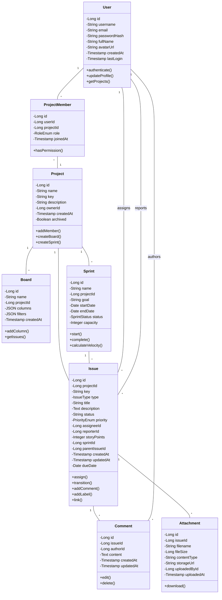

### 6.3 Entity-Relationship Diagram

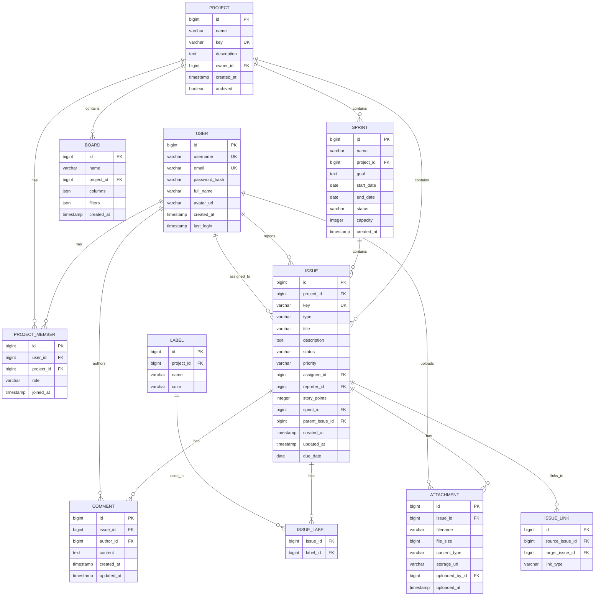

**Relationships:**

- **User ↔ Project** (Many-to-Many through ProjectMember)
  - A user can be a member of multiple projects
  - A project has multiple members with different roles
  - ProjectMember stores the role (Owner, Member, Viewer)

- **Project ↔ Board** (One-to-Many)
  - A project can have multiple boards (e.g., Kanban, Sprint Board)
  - Each board belongs to exactly one project

- **Project ↔ Sprint** (One-to-Many)
  - A project contains multiple sprints over time
  - Each sprint belongs to one project

- **Sprint ↔ Issue** (One-to-Many)
  - A sprint contains multiple issues
  - An issue can be assigned to zero or one sprint

- **Project ↔ Issue** (One-to-Many)
  - A project contains all issues (in sprints or backlog)
  - Each issue belongs to exactly one project

- **Issue ↔ Issue** (Many-to-Many, self-referential)
  - Issues can link to other issues (blocks, relates to, parent-child)
  - Implemented via IssueLink junction table

- **User ↔ Issue** (Multiple One-to-Many)
  - User as Reporter: One user reports many issues
  - User as Assignee: One user is assigned many issues

- **Issue ↔ Comment** (One-to-Many)
  - An issue has multiple comments
  - Each comment belongs to one issue

- **Issue ↔ Attachment** (One-to-Many)
  - An issue can have multiple attachments
  - Each attachment belongs to one issue

- **Issue ↔ Label** (Many-to-Many)
  - An issue can have multiple labels
  - A label can be applied to multiple issues

### 6.4 Object Relationships and Constraints

**Cascade Behaviors:**
- Deleting a Project → cascade deletes all associated Boards, Sprints, Issues, Labels
- Deleting an Issue → cascade deletes all Comments and Attachments
- Deleting a User → sets Issues.assigneeId and Issues.reporterId to NULL, retains Comments with author marked as "Deleted User"

**Uniqueness Constraints:**
- User.username is unique across system
- User.email is unique across system
- Project.key is unique across system (e.g., "PROJ")
- Issue.key is unique within project (e.g., "PROJ-123")

**Referential Integrity:**
- ProjectMember.userId references User.id
- ProjectMember.projectId references Project.id
- Issue.projectId references Project.id (required)
- Issue.sprintId references Sprint.id (optional)
- Issue.assigneeId references User.id (optional)
- Sprint.projectId references Project.id (required)

**Business Rules:**
- Issue cannot be assigned to Sprint from different Project
- Sprint start date must be before end date
- Sprint status can only progress forward (Planning → Active → Completed)
- Issue status transitions must follow configured workflow
- Story points must be positive integers or null
- Project key must be 2-10 uppercase letters

---

## 7. System Architecture

### 7.1 Architecture Principles and Design Decisions

**Architectural Principles:**

1. **Separation of Concerns**
   - Clear separation between presentation, business logic, and data access layers
   - Each component has a single, well-defined responsibility

2. **Scalability First**
   - Stateless application servers for horizontal scaling
   - Database connection pooling and query optimization
   - Caching layer for frequently accessed data

3. **Security by Design**
   - Authentication at API gateway level
   - Role-based authorization in business layer
   - Input validation at all entry points

4. **Maintainability**
   - Clean code principles
   - Comprehensive unit and integration tests
   - Automated code quality checks

5. **API-First Design**
   - RESTful API as primary interface
   - Frontend as API consumer
   - Enables future mobile apps and integrations

**Key Design Decisions:**

- **Backend: Java with Spring Boot**
  - Rationale: Robust ecosystem, enterprise-grade, excellent ORM support
  - Spring Security for authentication/authorization
  - Spring Data JPA for database access
  - Spring WebSocket for real-time updates

- **Frontend: React with TypeScript**
  - Rationale: Fast development, large community, component reusability
  - TypeScript for type safety
  - React Query for server state management
  - Tailwind CSS for rapid UI development

- **Database: PostgreSQL**
  - Rationale: ACID compliance, JSON support, excellent performance
  - Mature replication and backup tools
  - Strong community support

- **Caching: Redis**
  - Session storage
  - Frequently accessed data (user profiles, project metadata)
  - Rate limiting counters

- **Real-time: WebSocket**
  - Board updates
  - Notifications
  - Collaborative features

### 7.2 Technologies and Frameworks

**Backend Stack:**
- **Runtime:** Java 17 LTS
- **Framework:** Spring Boot 3.2
  - Spring Web (REST controllers)
  - Spring Data JPA (database access)
  - Spring Security (authentication/authorization)
  - Spring WebSocket (real-time communication)
  - Spring Validation (input validation)
- **Database:** PostgreSQL 15
- **Cache:** Redis 7
- **Build Tool:** Maven 3.9
- **Testing:** JUnit 5, Mockito, TestContainers

**Frontend Stack:**
- **Runtime:** Node.js 20 LTS (development)
- **Framework:** React 18
- **Language:** TypeScript 5
- **Build Tool:** Vite
- **State Management:**
  - React Query (server state)
  - Zustand (client state)
- **UI Components:** Custom components with Tailwind CSS
- **HTTP Client:** Axios
- **WebSocket:** Socket.io-client
- **Testing:** Vitest, React Testing Library

**DevOps & Infrastructure:**
- **Containerization:** Docker
- **Orchestration:** Docker Compose (development), Kubernetes (production)
- **CI/CD:** GitHub Actions
- **Monitoring:** Prometheus, Grafana
- **Logging:** ELK Stack (Elasticsearch, Logstash, Kibana)
- **API Documentation:** Swagger/OpenAPI 3.0

**External Services:**
- **Email:** SMTP provider (SendGrid/AWS SES)
- **File Storage:** AWS S3 or MinIO (self-hosted)
- **CDN:** Cloudflare (optional for static assets)

### 7.3 Logical Architecture (Components and Relationships)

**Layered Architecture Overview:**

```mermaid
graph TB
    subgraph Client["CLIENT LAYER"]
        Browser[Web Browser]
        Mobile[Mobile Web]
        API[API Client]
    end

    subgraph Presentation["PRESENTATION LAYER"]
        React[React Application SPA]
        Components[Components]
        Hooks[Hooks]
        Routes[Routes]
    end

    subgraph Gateway["API GATEWAY LAYER"]
        Auth[Auth Filter]
        RateLimit[Rate Limit Filter]
        CORS[CORS Filter]
    end

    subgraph Application["APPLICATION LAYER"]
        RestControllers[REST Controllers]
        WSHandlers[WebSocket Handlers]
    end

    subgraph Business["BUSINESS LOGIC LAYER"]
        Services[Services]
        Models[Domain Models]
    end

    subgraph Data["DATA ACCESS LAYER"]
        Repositories[Repositories JPA]
        Cache[Cache Layer Redis]
    end

    subgraph Persistence["PERSISTENCE LAYER"]
        PostgreSQL[(PostgreSQL Database)]
        S3[(Object Storage S3)]
    end

    Client -->|HTTPS/WSS| Presentation
    Presentation -->|REST API/WS| Gateway
    Gateway --> Application
    Application --> Business
    Business --> Data
    Data --> Persistence

    style Client fill:#e3f2fd
    style Presentation fill:#fff3e0
    style Gateway fill:#f3e5f5
    style Application fill:#e8f5e9
    style Business fill:#fff9c4
    style Data fill:#fce4ec
    style Persistence fill:#e0f2f1
```

**Detailed Component Breakdown:**

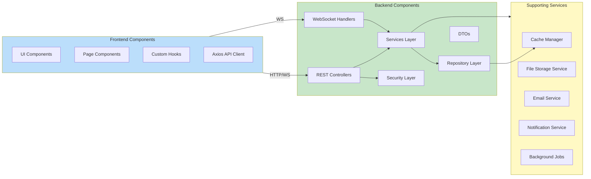

**Component Descriptions:**

**Frontend Components:**
- **React Application:** Single-page application serving the UI
- **Components:** Reusable UI elements (Button, Card, Modal, etc.)
- **Pages:** Route-level components (Dashboard, Board, Settings)
- **Hooks:** Custom React hooks for business logic (useAuth, useIssues)
- **API Client:** Axios instance configured for backend communication

**Backend Components:**
- **REST Controllers:** Handle HTTP requests, map to service methods
- **WebSocket Handlers:** Manage real-time connections and message routing
- **Services:** Contain business logic, orchestrate repository calls
- **Repositories:** Data access layer using Spring Data JPA
- **Security:** Authentication filters, JWT validation, authorization checks
- **DTOs:** Data transfer objects for API requests/responses

**Supporting Components:**
- **Cache Manager:** Redis integration for session and data caching
- **File Storage Service:** Manages attachment uploads to object storage
- **Email Service:** Sends notifications via SMTP
- **Notification Service:** Manages in-app and email notifications
- **Background Jobs:** Scheduled tasks (cleanup, reports, reminders)

### 7.4 Physical Architecture / Deployment View

**Development Environment:**

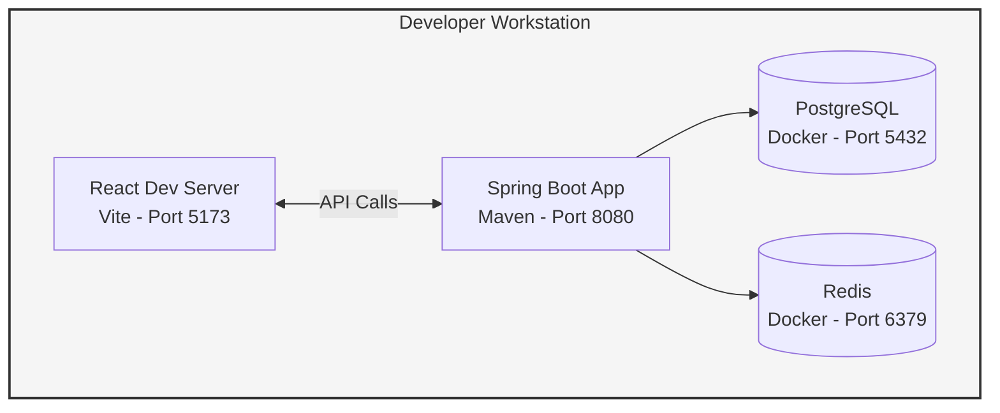

**Production Environment (Single Server):**

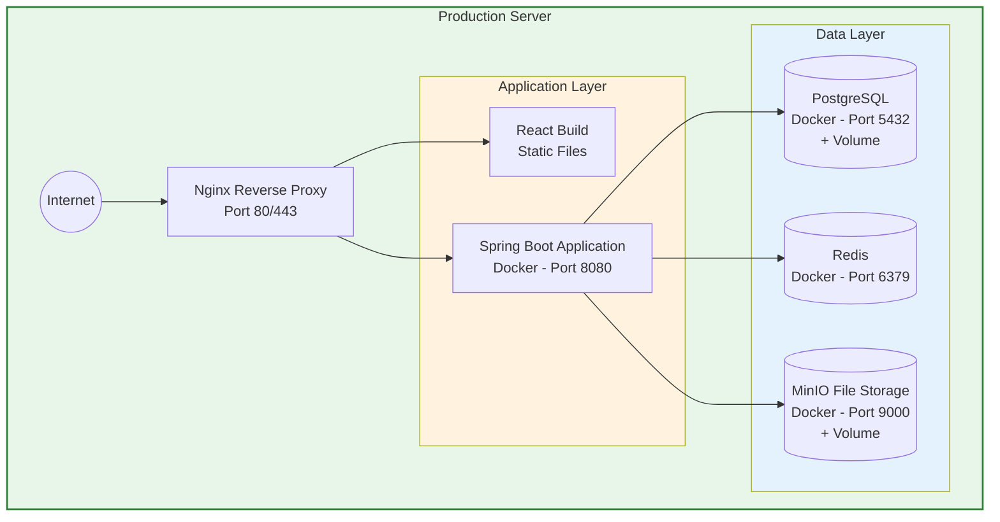

**Production Environment (Scaled with High Availability):**

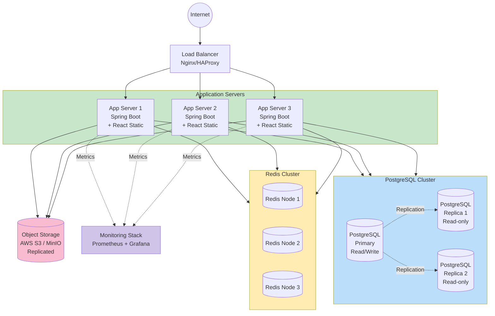

**Container Communication Flow:**

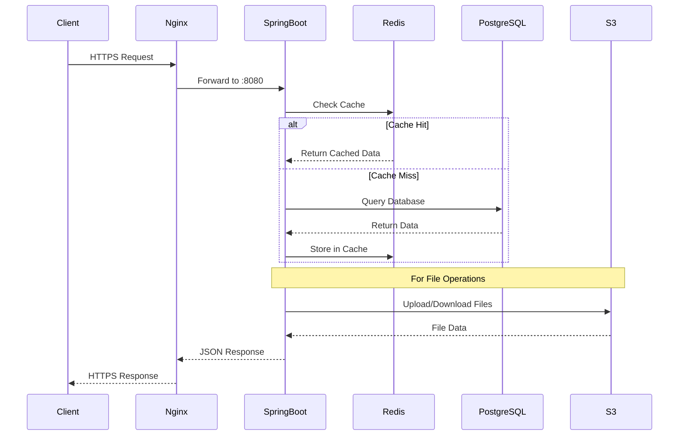

**Deployment Specifications:**

| Environment | CPU | RAM | Storage | Details |
|-------------|-----|-----|---------|---------|
| **Development** | 2 cores | 4 GB | 20 GB SSD | Linux, macOS, Windows with Docker |
| **Production (Single)** | 4 cores | 8 GB | 100 GB SSD | Ubuntu 22.04 LTS, 100 Mbps network |
| **Production (App Server)** | 4-8 cores | 16 GB | 50 GB SSD | Per server in cluster |
| **Database Server** | 8 cores | 32 GB | 500 GB SSD | PostgreSQL with replication |
| **Redis Server** | 2 cores | 8 GB | 50 GB SSD | Cluster configuration |

**Container Configuration:**

| Service | Base Image | Version | Notes |
|---------|------------|---------|-------|
| Spring Boot | OpenJDK Alpine | 17 | Minimal footprint |
| PostgreSQL | postgres:alpine | 15 | Official image |
| Redis | redis:alpine | 7 | Official image |
| Nginx | nginx:alpine | latest | Official image |

**Network Configuration:**

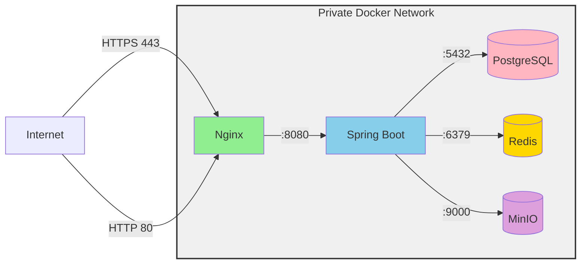

**Security & Network Rules:**
- All services operate in private Docker network
- Only Nginx exposed to internet (ports 80/443)
- Internal services communicate via container names
- SSL/TLS termination at load balancer
- WebSocket connections upgraded from HTTP
- Firewall rules restrict direct database access

---

## 8. User Interface and Prototypes

### 8.1 Key Screen Descriptions and Layouts

#### Screen 1: Dashboard / Projects Overview

**Purpose:** Main landing page showing user's projects and recent activity

**Layout Structure:**
- **Header Navigation Bar**
  - Logo (left)
  - Main navigation: Projects, Boards, Reports (center-left)
  - User profile menu and settings (right)

- **Main Content Area**
  - Section: "Your Projects"
    - Grid layout (2-4 columns responsive)
    - Create new project button (top-right)
  
- **Project Cards** (per project):
  - Project name and icon
  - Key metrics: Active issues count, team member count, current sprint number
  - Quick action button: "Open Board"
  - Visual status indicator (color-coded)

- **Recent Activity Feed**
  - Chronological list of team activities
  - Each item shows: Actor, action, target issue, timestamp
  - Real-time updates
  - Filter options by project

**User Flow:**
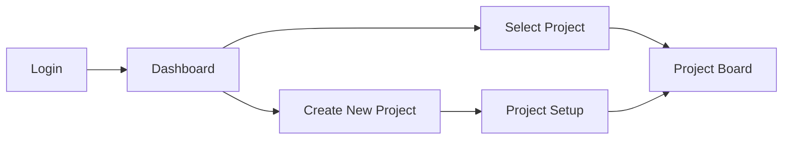

**Key Interactions:**
- Click project card → Navigate to project board
- Click "+ New Project" → Open project creation modal
- Click activity item → Navigate to specific issue
- Hover on project → Show quick actions (settings, archive)

---

#### Screen 2: Kanban Board

**Purpose:** Visual representation of work items organized by workflow status

**Layout Structure:**
- **Top Bar**
  - Breadcrumb navigation (Home > Project > Board)
  - Sprint selector dropdown
  - User profile (right)
  - Settings icon (right)

- **Action Bar**
  - Quick add button (create issue inline)
  - Search bar with autocomplete
  - Filter toggles (by assignee, label, type)
  - View options (compact/detailed cards)

- **Board Columns** (horizontal scrollable)
  - Each column represents a workflow state (To Do, In Progress, Review, Done)
  - Column header shows state name and issue count
  - "+ Add" button at bottom of each column

- **Issue Cards** (within columns):
  - Issue type icon (Story, Bug, Task)
  - Issue key (PROJ-123)
  - Title (truncated if long)
  - Assignee avatar
  - Story points badge
  - Labels (color-coded chips)
  - Visual priority indicator

**Board Flow Diagram:**
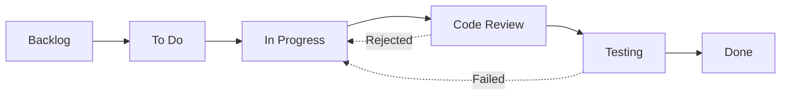

**Key Interactions:**
- Drag card between columns → Update issue status
- Click card → Open issue detail modal
- Click "+ Add" → Quick create issue in that column
- Use keyboard shortcuts (j/k to navigate, enter to open)
- Real-time updates when other users move cards

---

#### Screen 3: Issue Detail View

**Purpose:** Comprehensive view and editing of a single issue

**Layout Structure:**
- **Header**
  - Back navigation button
  - Issue key (large, prominent)
  - Close button
  - Issue type badge

- **Title Area**
  - Editable title (inline editing)
  - Status dropdown
  - Priority dropdown

- **Metadata Grid** (2-column layout)
  - Left column: Assignee, Sprint, Labels
  - Right column: Story points, Due date, Reporter
  - All fields are editable dropdowns or inputs

- **Description Section**
  - Rich text editor with Markdown support
  - Collapsible acceptance criteria checklist
  - Edit/view mode toggle

- **Attachments Section**
  - Grid of file thumbnails (images) or icons (documents)
  - File name, size, upload date
  - Drag-and-drop upload area

- **Activity Timeline**
  - Reverse chronological feed
  - System activities (status changes, assignments)
  - User comments with @mentions
  - Edit history with diff view

- **Comment Input**
  - Rich text editor
  - @mention autocomplete
  - File attachment option
  - Submit button

**Issue Lifecycle Flow:**
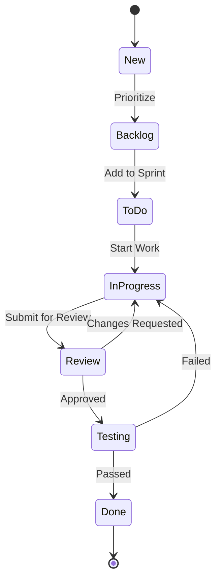

**Key Interactions:**
- Click any field → Edit inline
- Type "@" in comment → Mention user
- Upload file → Drag onto description or attachments area
- Link issues → Use "PROJ-123" syntax in comments
- Watch issue → Receive notifications

---

#### Screen 4: Sprint Planning

**Purpose:** Plan and commit work for upcoming sprint

**Layout Structure:**
- **Header Section**
  - Sprint name (editable)
  - Date range picker (start and end dates)
  - Sprint goal input (large text field)

- **Capacity Indicator**
  - Team velocity (average from last 3 sprints)
  - Committed story points with progress bar
  - Remaining capacity calculation
  - Visual indicator (green/yellow/red based on capacity)

- **Dual Panel Layout**
  - **Left Panel: Product Backlog**
    - Prioritized list of issues
    - Each item shows: Type, key, title, points, priority
    - "Move to Sprint" button per item
    - Infinite scroll/pagination
    - Drag-and-drop enabled
  
  - **Right Panel: Sprint Backlog**
    - Issues committed to sprint
    - Grouped by assignee (optional)
    - Drag to reorder priority
    - Remove from sprint option
    - Total points counter

- **Action Buttons** (bottom)
  - Cancel (discard changes)
  - Save Draft (save without starting)
  - Start Sprint (commit and begin)

**Sprint Planning Flow:**
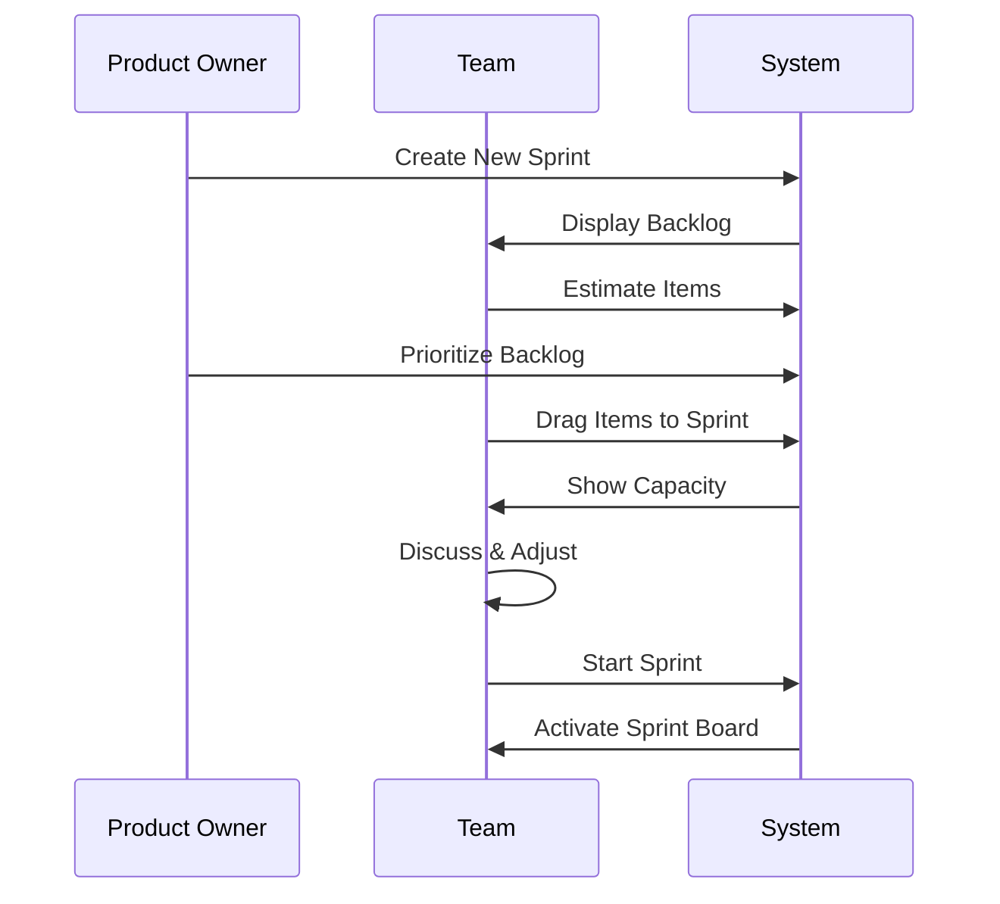

**Key Interactions:**
- Drag issue from backlog to sprint → Add to commitment
- Click story points → Quick edit estimation
- Hover over capacity bar → See breakdown by person
- Auto-refresh velocity when sprint dates change
- Warning if over/under capacity

---

#### Screen 5: Reports Dashboard

**Purpose:** Visualize sprint progress and team performance metrics

**Layout Structure:**
- **Header**
  - Sprint selector dropdown
  - Date range display
  - Export button (PDF, CSV)

- **Key Metrics Cards** (3-column grid)
  - Committed Points (total)
  - Completed Points (green)
  - Incomplete Points (yellow/red)
  - Each card shows large number and small trend indicator

- **Primary Chart: Sprint Burndown**
  - Line chart showing remaining work over time
  - X-axis: Days in sprint
  - Y-axis: Story points remaining
  - Two lines: Actual (solid) vs. Ideal (dashed)
  - Visual indicators for weekends
  - Hover for daily details

- **Velocity Trend Chart**
  - Bar chart showing last 6 sprints
  - X-axis: Sprint numbers
  - Y-axis: Completed story points
  - Average line overlay
  - Click bar to drill into sprint

- **Issue Distribution**
  - Horizontal stacked bar chart
  - Shows percentage by status
  - Color-coded sections
  - Issue count labels

- **Action Links** (bottom)
  - View detailed analytics
  - Export report
  - Share dashboard link

**Reporting Flow:**
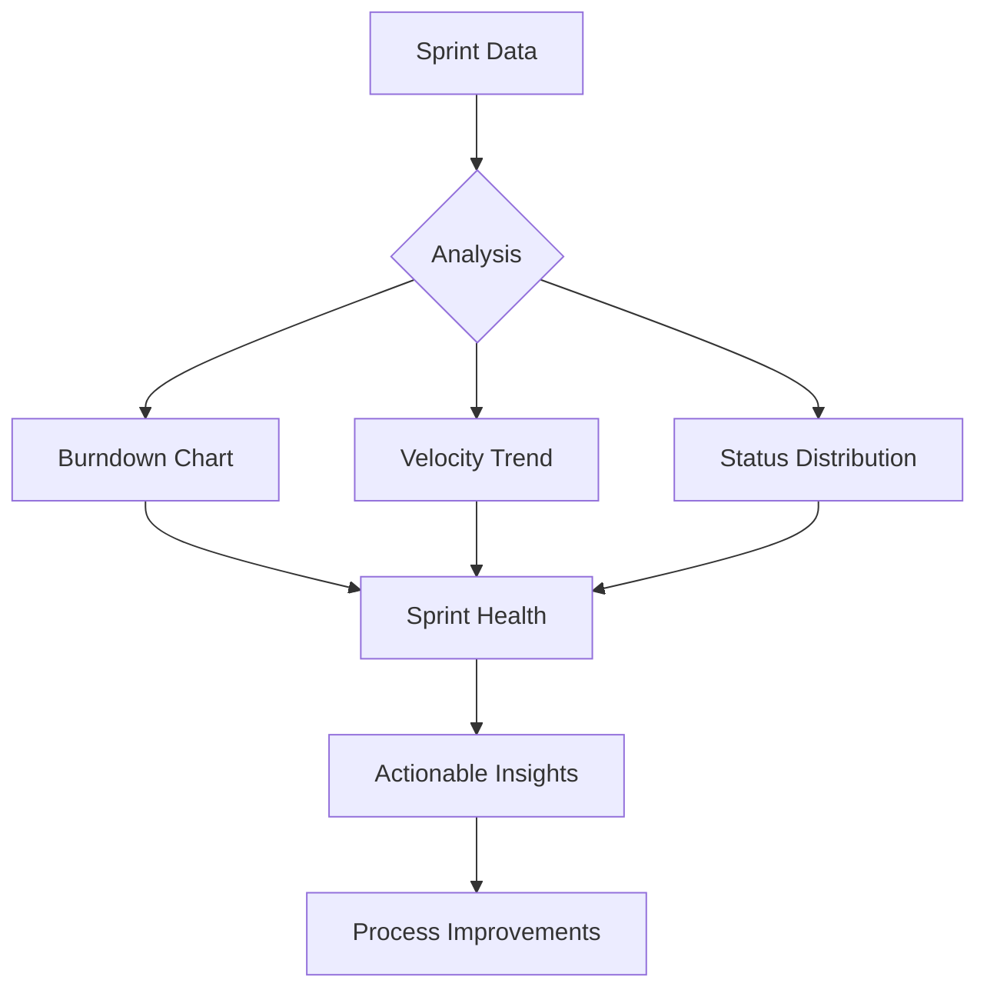

**Key Interactions:**
- Select different sprint → Refresh all charts
- Hover on chart data point → Show tooltip details
- Click chart element → Drill down to issue list
- Export → Generate PDF with all charts
- Real-time updates as issues move to "Done"

---

### 8.2 Interactive Prototypes and User Flows

#### Main User Journey: Create Issue to Completion

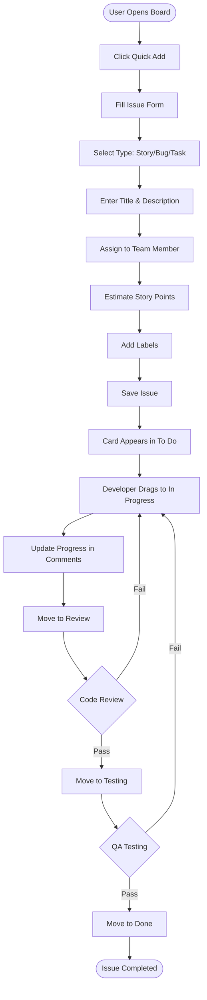

#### Sprint Cycle Journey

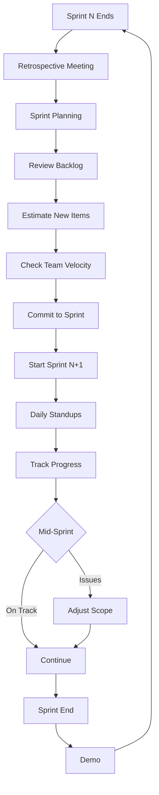

### 8.3 Component Hierarchy and Design System

#### Color Palette
- **Primary:** Blue (#2563EB) - Actions, links, primary buttons
- **Success:** Green (#10B981) - Completed items, positive states
- **Warning:** Yellow (#F59E0B) - Medium priority, warnings
- **Danger:** Red (#EF4444) - High priority, errors, destructive actions
- **Neutral:** Gray scale (#F3F4F6 to #1F2937) - Text, backgrounds, borders

#### Typography
- **Headings:** Inter font family, bold weights
- **Body:** Inter font family, regular weight
- **Code:** Monospace for issue keys and technical content
- **Sizes:** 12px (small), 14px (body), 16px (medium), 20px (large), 24px+ (headings)

#### Component Library
- **Buttons:** Primary, Secondary, Text, Icon-only
- **Cards:** Standard, Draggable, Compact
- **Inputs:** Text, Textarea, Select, Date picker, File upload
- **Navigation:** Tabs, Breadcrumbs, Sidebar, Dropdown menus
- **Feedback:** Toasts, Modals, Tooltips, Inline alerts
- **Data Display:** Tables, Lists, Grids, Charts

---

### 8.4 User Experience Principles

#### Core UX Principles

**1. Simplicity First**
- Maximum 3 clicks to reach any feature
- Progressive disclosure: Show basics, hide complexity
- Single-column layouts for focus
- White space to reduce cognitive load
- Clear call-to-action buttons

**2. Speed and Responsiveness**
- Instant feedback for all interactions
- Optimistic UI updates (assume success, rollback on error)
- Skeleton screens replace spinners
- Keyboard shortcuts: `C` (create), `K` (search), `/` (quick nav), `Esc` (close)
- Pre-load common data for instant navigation

**3. Consistency**
- Same terminology everywhere (no "ticket" vs "issue" confusion)
- Consistent icon usage (same icon = same action)
- Predictable button placement (primary action always right)
- Standard drag-and-drop behavior across all boards
- Unified color coding for status and priority

**4. Flexibility**
- Customizable board columns
- Saved filter presets
- Personal dashboard layouts
- Configurable notification preferences
- Multiple view options (list, board, calendar)

**5. Collaboration**
- Real-time presence indicators (who's viewing what)
- Live cursors on shared boards
- @mentions with instant notifications
- Threaded comments for organized discussions
- Activity feed with filtering

**6. Data Visualization**
- Charts over numbers (visual > text)
- Color-coded status indicators
- Progress bars for sprints
- Trend arrows for velocity
- Heatmaps for workload distribution

#### Accessibility Implementation (WCAG 2.1 Level AA)

**Perceivable**
- Contrast ratio 4.5:1 minimum (7:1 for small text)
- All icons paired with text labels
- Status indicated by icon + color + text
- Scalable up to 200% zoom
- Alt text for all meaningful images
- Captions for video tutorials

**Operable**
- Full keyboard navigation with Tab/Shift+Tab
- Escape key closes modals and dropdowns
- Skip links to main content
- Focus visible with 2px blue outline
- No keyboard traps in modals
- Generous click targets (44x44px minimum)

**Understandable**
- Plain language (Agile terms defined in help)
- Consistent navigation structure
- Inline validation with helpful messages
- Undo available for critical actions
- Clear error messages with solutions
- Step-by-step wizards for complex tasks

**Robust**
- Semantic HTML5 (header, nav, main, article)
- ARIA landmarks for screen readers
- aria-label for icon-only buttons
- Live regions for dynamic updates
- Works with NVDA, JAWS, VoiceOver
- Graceful degradation (works without JS for core functions)

#### Mobile-First Design

**Responsive Breakpoints**
- Mobile: < 640px (single column, essential features)
- Tablet: 640px - 1024px (two columns, simplified board)
- Desktop: > 1024px (full features, multi-column boards)

**Mobile Optimizations**
- Bottom navigation bar (thumb-friendly)
- Swipe gestures (swipe card to change status)
- Pull-to-refresh for boards
- Simplified issue form (fewer fields)
- Offline mode with sync
- Touch targets minimum 48x48px
- No hover states (use tap)

---

### 8.5 Prototype Links and Design Assets

#### Interactive Prototypes (Future Implementation)
For full interactive prototypes, the following tools are recommended:
- **Figma:** High-fidelity mockups and interactive flows
- **Balsamiq:** Low-fidelity wireframes for rapid iteration
- **InVision:** Clickable prototypes for user testing

#### Design System Documentation
The component library and design tokens will be documented in:
- **Storybook:** Interactive component library with live examples
- **Style Guide:** Color palette, typography, spacing system
- **Icon Library:** Lucide React icons with consistent sizing

#### User Testing Materials
- **Test Scenarios:** 10 common user tasks for usability testing
- **Feedback Forms:** Post-task satisfaction surveys
- **Analytics:** Hotjar/Mixpanel for behavior tracking
- **A/B Tests:** Test variations of critical user flows

#### Design Deliverables Checklist
- [ ] High-fidelity mockups for all 5 key screens
- [ ] Interactive prototype demonstrating main user flows
- [ ] Responsive layouts (mobile, tablet, desktop)
- [ ] Dark mode variants
- [ ] Empty states and error states
- [ ] Loading states and skeleton screens
- [ ] Icon set selection and implementation
- [ ] Design tokens (colors, spacing, typography)
- [ ] Component library in Storybook
- [ ] Accessibility audit report

---

## 9. Risk Analysis

### 9.1 Main Risks

**Technical Risks:**

**T-1: Database Performance Degradation**
- **Severity:** High
- **Likelihood:** Medium
- **Description:** As data volume grows (100k+ issues), query performance may degrade, impacting user experience
- **Impact:** Slow page loads, timeouts, user frustration, potential data loss during high load
- **Indicators:** Query response times >1s, increased database CPU usage, user complaints

**T-2: Real-time Synchronization Issues**
- **Severity:** Medium
- **Likelihood:** Medium
- **Description:** WebSocket connections may fail or desynchronize, causing stale data in UI
- **Impact:** Users seeing outdated information, conflicts when updating same issue, confusion
- **Indicators:** Connection drops, stale board state, duplicate updates

**T-3: File Storage Scalability**
- **Severity:** Medium
- **Likelihood:** Low
- **Description:** Attachment storage could exceed budget or available space
- **Impact:** Users unable to upload files, system downtime for storage expansion
- **Indicators:** Storage utilization >80%, upload failures

**T-4: Third-party Dependency Vulnerabilities**
- **Severity:** High
- **Likelihood:** Medium
- **Description:** Security vulnerabilities discovered in Spring Boot, React, or other dependencies
- **Impact:** System compromise, data breach, downtime for patching
- **Indicators:** Security advisories, automated scanning alerts

**Security Risks:**

**S-1: Authentication Bypass**
- **Severity:** Critical
- **Likelihood:** Low
- **Description:** Flaw in JWT validation or session management allowing unauthorized access
- **Impact:** Complete system compromise, data breach, legal liability
- **Indicators:** Suspicious login patterns, unauthorized access logs

**S-2: SQL Injection**
- **Severity:** Critical
- **Likelihood:** Low
- **Description:** Unsanitized user input used in database queries
- **Impact:** Data theft, data manipulation, potential data loss
- **Indicators:** Unusual query patterns in logs, database alerts

**S-3: Cross-Site Scripting (XSS)**
- **Severity:** High
- **Likelihood:** Medium
- **Description:** Malicious scripts injected through issue descriptions or comments
- **Impact:** Session hijacking, credential theft, phishing attacks
- **Indicators:** Unusual JavaScript execution, user reports of strange behavior

**S-4: Insufficient Rate Limiting**
- **Severity:** Medium
- **Likelihood:** Medium
- **Description:** API endpoints can be abused for DDoS or brute force attacks
- **Impact:** Service degradation, account takeovers, increased infrastructure costs
- **Indicators:** Abnormal traffic patterns, repeated failed login attempts

**Business Risks:**

**B-1: Low User Adoption**
- **Severity:** High
- **Likelihood:** Medium
- **Description:** Teams find the system too complex or lacking features compared to competitors
- **Impact:** Project failure, wasted development resources, revenue loss
- **Indicators:** Low signup rates, high churn, negative feedback

**B-2: Feature Scope Creep**
- **Severity:** Medium
- **Likelihood:** High
- **Description:** Continuous addition of features delays initial release
- **Impact:** Market opportunity missed, team burnout, budget overruns
- **Indicators:** Extended timelines, incomplete features, team stress

**B-3: Inadequate Documentation**
- **Severity:** Medium
- **Likelihood:** Medium
- **Description:** Users struggle to onboard due to poor documentation
- **Impact:** Support burden, user frustration, negative reviews
- **Indicators:** Frequent support tickets, similar questions repeatedly

**B-4: Competitor Feature Parity**
- **Severity:** Medium
- **Likelihood:** High
- **Description:** Established competitors quickly replicate our unique features
- **Impact:** Loss of differentiation, difficulty attracting users
- **Indicators:** Competitor product updates, market analysis

**Project Risks:**

**P-1: Key Developer Departure**
- **Severity:** High
- **Likelihood:** Low
- **Description:** Lead developer(s) leave during critical development phase
- **Impact:** Knowledge loss, delayed delivery, quality issues
- **Indicators:** Team dissatisfaction, competing job offers

**P-2: Underestimated Complexity**
- **Severity:** Medium
- **Likelihood:** High
- **Description:** Features take longer to implement than estimated
- **Impact:** Missed deadlines, budget overruns, incomplete features
- **Indicators:** Sprint velocity below targets, incomplete sprint goals

**P-3: Inadequate Testing**
- **Severity:** High
- **Likelihood:** Medium
- **Description:** Rushed release without comprehensive testing
- **Impact:** Critical bugs in production, data loss, reputation damage
- **Indicators:** Low test coverage, bugs found in production, user complaints

### 9.2 Risk Mitigation Strategies

**Technical Risk Mitigation:**

**T-1: Database Performance Degradation**
- **Prevention:**
  - Design database indexes for common queries from day one
  - Implement caching layer (Redis) for frequently accessed data
  - Use database query analysis tools during development
  - Implement pagination for all list views
- **Detection:**
  - Monitor query performance with APM tools (New Relic, Datadog)
  - Set up alerts for queries exceeding 500ms
  - Regular database performance reviews
- **Response:**
  - Emergency: Enable read replicas to distribute load
  - Optimize slow queries identified by monitoring
  - Archive old data to separate tables
  - Consider database sharding if needed

**T-2: Real-time Synchronization Issues**
- **Prevention:**
  - Implement heartbeat mechanism for WebSocket connections
  - Automatic reconnection with exponential backoff
  - Version tracking for conflict detection
  - Fallback to polling if WebSocket unavailable
- **Detection:**
  - Log connection drops and reconnections
  - Monitor message delivery success rates
  - User reports of stale data
- **Response:**
  - Display connection status to users
  - Prompt user to refresh on detected staleness
  - Implement conflict resolution UI
  - Provide manual refresh option

**T-3: File Storage Scalability**
- **Prevention:**
  - Set per-user and per-project attachment limits
  - Implement file size restrictions (10MB per file)
  - Compress images automatically
  - Use cloud storage with pay-as-you-grow pricing
- **Detection:**
  - Monitor storage usage daily
  - Alert at 80% capacity
  - Track upload patterns
- **Response:**
  - Increase storage allocation proactively
  - Implement file retention policies (archive old attachments)
  - Offer paid upgrade for more storage
  - Provide download and migrate to external storage option

**T-4: Third-party Dependency Vulnerabilities**
- **Prevention:**
  - Use Dependabot or Snyk for automated dependency scanning
  - Regular dependency updates (monthly)
  - Prefer well-maintained, popular libraries
  - Lock dependency versions in production
- **Detection:**
  - Automated daily security scans
  - Subscribe to security mailing lists
  - Monitor CVE databases
- **Response:**
  - Emergency patch process for critical vulnerabilities
  - Test updates in staging before production deployment
  - Document all dependency versions
  - Have rollback plan ready

**Security Risk Mitigation:**

**S-1: Authentication Bypass**
- **Prevention:**
  - Use industry-standard libraries (Spring Security)
  - Implement automated security tests
  - Regular security code reviews
  - Penetration testing before launch
- **Detection:**
  - Monitor failed login attempts
  - Alert on suspicious login patterns (unusual location, time)
  - Log all authentication events
- **Response:**
  - Immediate password reset for affected accounts
  - Revoke all active sessions
  - Investigate attack vector
  - Deploy patch within 24 hours

**S-2: SQL Injection**
- **Prevention:**
  - Use parameterized queries exclusively (JPA/Hibernate)
  - Input validation on all user inputs
  - Principle of least privilege for database users
  - Code review for all database interactions
- **Detection:**
  - Database query logging
  - Automated SQL injection scanning (OWASP ZAP)
  - Unusual query patterns
- **Response:**
  - Block malicious IP addresses
  - Audit all database queries
  - Verify data integrity
  - Inform affected users if data compromised

**S-3: Cross-Site Scripting (XSS)**
- **Prevention:**
  - Content Security Policy (CSP) headers
  - Input sanitization for all user-generated content
  - Output encoding in templates
  - Use React's built-in XSS protection
- **Detection:**
  - Automated XSS scanning
  - Security headers monitoring
  - User reports of suspicious content
- **Response:**
  - Remove malicious content immediately
  - Identify injection point and patch
  - Notify affected users
  - Review all similar input points

**S-4: Insufficient Rate Limiting**
- **Prevention:**
  - Implement rate limiting at API gateway level
  - Different limits for authenticated/unauthenticated users
  - CAPTCHA for repeated failures
  - IP-based throttling
- **Detection:**
  - Monitor requests per IP and user
  - Alert on abnormal traffic spikes
  - Analyze failed request patterns
- **Response:**
  - Automatically block IPs exceeding limits
  - Scale infrastructure if legitimate traffic surge
  - Contact users if legitimate use affected
  - Review and adjust limits based on patterns

**Business Risk Mitigation:**

**B-1: Low User Adoption**
- **Prevention:**
  - Conduct user research before building features
  - Beta testing with target users
  - Focus on core features first (MVP approach)
  - Gather and act on user feedback continuously
- **Detection:**
  - Track signup and activation rates
  - Monitor user engagement metrics
  - Conduct user interviews
  - Net Promoter Score (NPS) surveys
- **Response:**
  - Prioritize feedback from churned users
  - Improve onboarding experience
  - Add most-requested features
  - Consider pivoting if fundamental issues

**B-2: Feature Scope Creep**
- **Prevention:**
  - Maintain strict product roadmap
  - Define MVP clearly with stakeholder agreement
  - Regular scope review meetings
  - Use MoSCoW prioritization (Must, Should, Could, Won't)
- **Detection:**
  - Sprint velocity trending down
  - Stories not fitting in sprints
  - Team working overtime
- **Response:**
  - Re-prioritize features, defer non-critical items
  - Communicate timeline impacts to stakeholders
  - Consider phased releases
  - Add resources only if budget allows

**B-3: Inadequate Documentation**
- **Prevention:**
  - Document features during development, not after
  - Allocate specific time for documentation in sprints
  - Use documentation templates
  - Video tutorials for complex features
- **Detection:**
  - Support ticket analysis
  - User feedback on documentation quality
  - Onboarding completion rates
- **Response:**
  - Create FAQ based on support tickets
  - Improve search functionality in help center
  - Add contextual help in application
  - Consider hiring technical writer

**B-4: Competitor Feature Parity**
- **Prevention:**
  - Focus on unique value proposition (simplicity + power)
  - Build features competitors can't easily copy
  - Strong brand and community
  - Continuous innovation pipeline
- **Detection:**
  - Regular competitor analysis
  - Monitor their product updates
  - Track feature requests mentioning competitors
- **Response:**
  - Double down on differentiators
  - Innovate faster than competitors
  - Build switching costs (data lock-in ethically)
  - Focus on customer service excellence

**Project Risk Mitigation:**

**P-1: Key Developer Departure**
- **Prevention:**
  - Comprehensive code documentation
  - Pair programming for knowledge sharing
  - Regular knowledge transfer sessions
  - Competitive compensation and culture
- **Detection:**
  - Regular one-on-ones to gauge satisfaction
  - Notice period gives time to prepare
- **Response:**
  - Immediate knowledge transfer sessions
  - Document critical systems before departure
  - Cross-train other team members
  - Hire replacement quickly if critical
  - Consider contractor for temporary coverage

**P-2: Underestimated Complexity**
- **Prevention:**
  - Build buffer into estimates (25-50%)
  - Break large features into smaller stories
  - Research spikes for unknown areas
  - Consult with experienced developers
- **Detection:**
  - Stories consistently exceeding estimates
  - Sprint goals not met multiple times
  - Code reviews taking longer than expected
- **Response:**
  - Re-estimate remaining work realistically
  - Simplify features where possible
  - Extend timeline or reduce scope
  - Add resources if budget allows

**P-3: Inadequate Testing**
- **Prevention:**
  - Automated testing from day one (aim for 80% coverage)
  - Dedicated QA time in each sprint
  - Testing environment mirrors production
  - Acceptance criteria defined for all stories
- **Detection:**
  - Bugs discovered in production
  - Low test coverage metrics
  - Manual testing taking long time
- **Response:**
  - Stop feature development, focus on quality
  - Add automated tests for found bugs
  - Conduct thorough regression testing
  - Consider QA contractor if needed
  - Implement staged rollouts to limit impact

---

## 10. Additional Documentation

### 10.1 Constraints and Assumptions

**Technical Constraints:**

1. **Backend must use Java**
   - Requirement for maintainability and team expertise
   - Spring Boot ecosystem for rapid development
   - JVM performance characteristics

2. **Browser Support**
   - Modern evergreen browsers only (Chrome, Firefox, Safari, Edge)
   - No Internet Explorer support
   - JavaScript must be enabled

3. **Database**
   - PostgreSQL 15 or higher required for JSON support and performance
   - Single database instance initially (no distributed database)

4. **File Size Limits**
   - Maximum 10 MB per attachment upload
   - Total storage per project: 5 GB (configurable)

5. **API Rate Limits**
   - 1000 API requests per hour per user
   - 100 concurrent WebSocket connections per server

6. **Infrastructure**
   - Minimum 4 GB RAM for production deployment
   - Linux-based hosting environment
   - Docker container support required

**Business Constraints:**

1. **Budget**
   - Development limited to 6-month timeline for MVP
   - Infrastructure costs must remain under $500/month initially
   - No licensing fees for core technologies

2. **Team Size**
   - Development team: 3-5 developers
   - No dedicated QA initially (developers perform testing)
   - Part-time product owner

3. **Compliance**
   - GDPR compliance required for European users
   - No specific industry certifications required (SOC 2, ISO) for MVP
   - Privacy policy and terms of service required

4. **Localization**
   - English language only for MVP
   - UI should be designed for future localization (i18n support)

**Assumptions:**

1. **User Behavior**
   - Users have stable internet connection (minimum 1 Mbps)
   - Users are familiar with basic project management concepts
   - Teams will have 2-20 members on average
   - Projects will have 50-500 issues on average

2. **Infrastructure**
   - Cloud hosting provider available (AWS, GCP, or DigitalOcean)
   - Email delivery service available (SendGrid, AWS SES)
   - CDN available for static asset delivery

3. **Development**
   - Team has proficiency in Java/Spring Boot and React
   - Continuous integration pipeline can be set up
   - Code review process will be followed

4. **Market**
   - Demand exists for simplified project management tools
   - Users willing to migrate from existing tools
   - Freemium model will attract initial users

5. **Data**
   - Users will not require data migration from other systems initially
   - Data retention of 2 years is sufficient for most users
   - Daily backups are acceptable (not real-time replication)

### 10.2 Relationships with Other Systems

**Initial Release (Phase 1):**

The system will be **standalone** with minimal external integrations:

**Required External Services:**
1. **Email Service (SMTP)**
   - Purpose: Send notification emails
   - Direction: Outbound only
   - Protocol: SMTP/TLS
   - Providers: SendGrid, AWS SES, Mailgun
   - Data: User email addresses, notification content

2. **Object Storage (S3-compatible)**
   - Purpose: Store file attachments
   - Direction: Bidirectional
   - Protocol: S3 API / HTTPS
   - Providers: AWS S3, MinIO, Backblaze B2
   - Data: File uploads, metadata

**Optional External Services:**
1. **OAuth Providers** (Phase 2)
   - Purpose: Social login (Google, GitHub)
   - Direction: Inbound authentication requests
   - Protocol: OAuth 2.0
   - Integration: Spring Security OAuth2

2. **Monitoring Services**
   - Prometheus for metrics collection
   - Grafana for visualization
   - ELK stack for log aggregation
   - Sentry for error tracking

**Future Integration Points (Post-MVP):**

**Version Control Systems:**
- **GitHub / GitLab / Bitbucket**
  - Link commits to issues via commit messages
  - Webhooks for automatic issue status updates
  - Display commits related to issue

**Communication Tools:**
- **Slack / Microsoft Teams**
  - Post notifications to channels
  - Create issues from chat messages
  - Bot commands for quick actions

**CI/CD Tools:**
- **Jenkins / GitHub Actions / GitLab CI**
  - Trigger builds from issue status changes
  - Update issues with build results
  - Link deployments to releases

**Time Tracking:**
- **Toggl / Harvest**
  - Track time spent on issues
  - Generate time reports

**Analytics:**
- **Google Analytics / Mixpanel**
  - Track user behavior
  - Feature usage statistics

**API Design for Integrations:**
- RESTful API with comprehensive documentation
- Webhook support for real-time event notifications
- OAuth 2.0 for third-party app authorization
- Rate limiting to prevent abuse
- Webhook events: issue.created, issue.updated, issue.deleted, sprint.started, sprint.completed

### 10.3 Future Plans and Extension Possibilities

**Phase 2 Enhancements (3-6 months post-launch):**

1. **Advanced Reporting**
   - Custom report builder
   - Cumulative flow diagrams
   - Cycle time and lead time analytics
   - Team productivity metrics
   - Export to PDF and Excel

2. **Enhanced Collaboration**
   - Real-time collaborative editing of issue descriptions
   - Video call integration for standup meetings
   - Team calendar with milestone visualization
   - @mentions with email notifications

3. **Mobile Applications**
   - Native iOS app
   - Native Android app
   - Optimized for quick updates and notifications
   - Offline mode with sync

4. **Workflow Automation**
   - Custom automation rules (if X then Y)
   - Automatic assignment based on criteria
   - Scheduled issue transitions
   - Integration with Zapier/IFTTT

5. **Time Tracking**
   - Log time spent on issues
   - Time estimates vs. actuals
   - Timesheet views
   - Billing and invoicing (optional)

**Phase 3 Enhancements (6-12 months post-launch):**

1. **Portfolio Management**
   - Multiple projects overview
   - Cross-project dependencies
   - Resource allocation across projects
   - Executive dashboards

2. **Advanced Agile Features**
   - Roadmap visualization (quarterly view)
   - Release planning with version management
   - Dependency tracking and critical path
   - Epic breakdown and tracking

3. **AI-Powered Features**
   - Smart issue prioritization suggestions
   - Automated story point estimation
   - Anomaly detection (blockers, delays)
   - Natural language issue creation

4. **Enterprise Features**
   - SAML/SSO integration
   - Advanced audit logging
   - Custom user roles and permissions
   - SLA management
   - White-labeling options

5. **Developer Tools**
   - CLI tool for issue management
   - IDE plugins (VSCode, IntelliJ)
   - Desktop application (Electron)
   - Git commit hooks integration

**Long-term Vision (12+ months):**

1. **Marketplace**
   - Third-party plugins and extensions
   - Custom field types
   - Workflow templates
   - Integration marketplace

2. **Advanced Analytics**
   - Predictive analytics (delivery dates, bottlenecks)
   - Team health metrics
   - Burnout detection
   - Recommendation engine for process improvements

3. **Collaboration Suite**
   - Built-in wiki/documentation
   - Meeting notes and action items
   - Team chat (similar to Slack)
   - Screen recording for bug reports

4. **Internationalization**
   - Multi-language support (10+ languages)
   - Currency and timezone handling
   - Localized date/time formats
   - Right-to-left language support

5. **Scalability Enhancements**
   - Multi-tenancy architecture
   - Global CDN for low latency
   - Database sharding for large customers
   - Distributed caching

**Extension Architecture:**

The system will be designed with extensibility in mind:

- **Plugin System:** API for custom plugins to extend functionality
- **Webhook Events:** Comprehensive event system for external integrations
- **REST API:** Full-featured API covering all system capabilities
- **Custom Fields:** Allow users to define custom fields for issues
- **Workflow Engine:** Configurable workflow states and transitions
- **Theming:** Support for custom CSS themes and white-labeling

**Open Source Strategy:**

Consider open-sourcing the core platform to:
- Build community and ecosystem
- Increase adoption and trust
- Allow self-hosting for security-conscious organizations
- Enable contributions from developers worldwide

**Monetization Path:**

- **Free Tier:** Up to 10 users, core features, community support
- **Pro Tier:** $10/user/month, advanced features, email support
- **Enterprise Tier:** Custom pricing, SSO, SLA, dedicated support
- **Self-Hosted:** One-time license fee + annual support contract

---

## Conclusion

This document provides a comprehensive blueprint for developing a project management information system that combines the best features of industry-leading tools (Jira, Trello, Pivotal Tracker) into a streamlined, user-friendly solution.

**Key Success Factors:**
- Focus on core features first (MVP approach)
- Prioritize user experience and performance
- Build with security and scalability in mind
- Iterative development with continuous user feedback
- Comprehensive testing and quality assurance

**Next Steps:**
1. Review and approve this document with stakeholders
2. Set up development environment and infrastructure
3. Begin Sprint 0: Technical foundation and architecture setup
4. Start iterative development of core features
5. Conduct user testing and gather feedback continuously

This system will empower software teams to collaborate effectively, deliver projects on time, and continuously improve their processes.

---

**Document Version:** 1.0  
**Last Updated:** October 7, 2025  
**Maintained By:** Project Management System Team  
**Contact:** [team@pmis-project.dev]